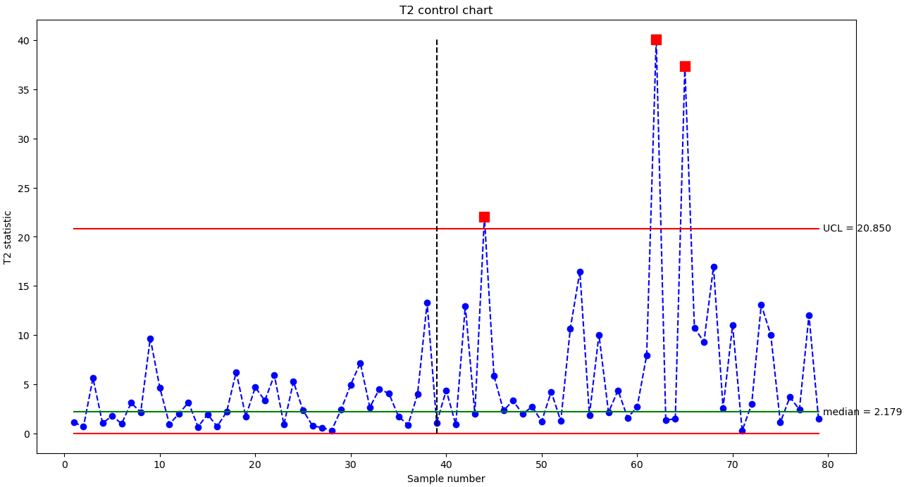

# 🛠️ SPC for 3D-Printed Parts

This project applies **Statistical Process Control (SPC)** techniques to monitor the quality of **3D-printed parts** using image-derived features.  
The objective is to detect potential deviations in the production process through **exploratory analysis, Quadratic Discriminant Analysis (QDA), and control charts with run rules**.

---

## 📌 Overview
- **Goal**: Monitor and classify 3D-printed parts based on image statistics.  
- **Data**: Two datasets of extracted features from images of 3D-printed parts.  
- **Methods**:  
  1. Exploratory Data Analysis (EDA) → summary statistics, feature inspection.  
  2. Quadratic Discriminant Analysis (QDA) → classification of parts.  
  3. Control Charts & Run Rules → monitoring process stability.  
- **Outcome**: A reproducible Python workflow for detecting potential quality issues in additive manufacturing.

---

## 🛠️ Tech Stack
- **Python**: numpy, pandas, matplotlib, seaborn, scikit-learn  
- **Jupyter Notebook**: analysis and visualization (`.ipynb`)  
- **Scripts**: modular Python code (`.py`)  

---

## 📂 Project Structure
```bash
spc-3d-printed-parts/
├── data/               # Input datasets (image statistics)
│   ├── image_statistics_new.csv
│   └── image_statistics_phase2.csv
├── notebooks/          # Jupyter notebooks
│   └── QDA.ipynb
├── src/                # Python source code
│   └── qda.py
├── assets/             # Plots and results (e.g., control charts)
├── .gitignore
├── LICENSE
└── README.md
```

---

## 📊 Data
- **`image_statistics_new.csv`** → initial dataset with extracted image features of 3D-printed parts.  
- **`image_statistics_phase2.csv`** → extended dataset for phase 2 analysis, enabling validation of models and monitoring improvements.  

Both datasets contain **image-derived statistical features** used for classification (QDA) and process monitoring (SPC charts).


---
## 🚀 How to Run

1. **Clone the repository**
```bash
git clone https://github.com/stesima/spc-3d-printed-parts.git
cd spc-3d-printed-parts
```

2. **Install required dependencies**
  - Make sure you have Python 3.8+ installed, then run:
```bash
pip install -r requirements.txt
```

3. **Run the analysis**
  - Via Python script:
```bash
python src/qda.py
```
  - Or interactively in Jupyter Notebook:
```bash
jupyter notebook notebooks/QDA.ipynb
```

---

## 📈 Sample Visualization
The figure below shows an example of a **control chart** used to monitor the stability of a feature across 3D-printed parts:



Control charts, combined with **run rules**, help to:
- Detect **out-of-control signals** (points beyond control limits),  
- Identify **non-random patterns** suggesting systematic issues,  
- Reveal **trends and drifts** that indicate potential process instability.  

These visual tools are essential for applying **Statistical Process Control (SPC)** in additive manufacturing.

---

## ⚠️ Limitations & Future Work
- The available datasets are limited to **two phases** of production; extending data collection would increase statistical robustness.  
- Current models rely solely on **image-derived features**; integrating production parameters (e.g., temperature, speed, material properties) could improve predictive accuracy.  
- Future research directions include:
  - Adoption of **multivariate control charts** (e.g., Hotelling’s T²),  
  - Exploration of **advanced machine learning methods** for defect detection,  
  - Development of a **real-time monitoring pipeline** for industrial implementation.  

---

## 📫 Contact
**Author**: Stefano Sima  

- 📧 Email: [stefano.sima@outlook.it](mailto:stefano.sima@outlook.it)  
- 💼 LinkedIn: [linkedin.com/in/stesima](https://www.linkedin.com/in/stesima)  
